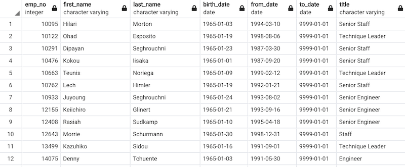
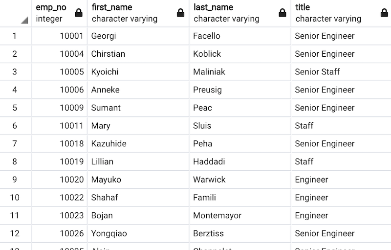
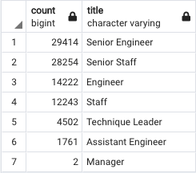
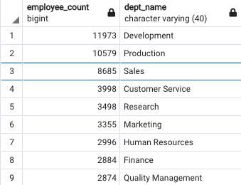

# Pewlett-Hackard-Analysis

## Overview

In this analysis, we will be looking at employee data for Pewlett Hackard to determine the number of retiring employees per title and identify employees who are eligible to participate in a mentorship program.

## Resources

- Data: Data/departments.csv
		Data/dept_emp.csv
		Data/dept_manager.csv
		Data/employees.csv
		Data/salaries.csv
		Data/titles.csv

- Software: pgAdmin 4 v5.2, postgreSQL

## Results

### Retirement titles
 
A number of employees have had multiple positions within the company. Without filtering duplicates employee numbers, there are 133776 positions which are occupied by employees due to retire. The employees were born from Jan 01, 1952 to Dec 31, 1955.

### Unique Title

Filtering out duplicate employee numbers, the actual number of retiring employees by title is 90398. These are employees that were born from Jan 01, 1952 to Dec 31, 1955 with unique titles. This table also includes employees whom may have already left the company.

### Retiring titles

This table shows the number of retiring employees from each position. Note that there is a large number of senior positions who will be retiring in the near future.

### Mentorship Eligibility

Currently in Pewlett Hackard, there are 1549 employees, who are eligible to participate in a mentorship program. These are current employees who are retirement-ready born in the year of 1965.

## Summary

* How many roles will need to be filled as the "silver tsunami" begins to make an impact?
From the Unique Title section above, there are current 90398 roles that will need to be filled.

* Are there enough qualified, retirement-ready employees in the departments to mentor the next generation of Pewlett Hackard employees?
Currently, there are 1549 employees who are eligible to participate in this program. These are current employees that were born in between January 1, 1965 to December 1, 1965. With 90398 employees set to retire (or already retired) in the next few years, this means that each of these employees will need to mentor 58-59 junior employees on average to make up for the "silver tsunami".

* Additional Comments

We can further figure out how many employees are retiring in the next few years. By running the following query, we see that there are 72458 employees that are currently employed, and that were born between 1952-01-01 and 1955-12-31.
SELECT DISTINCT e.emp_no,
    e.first_name,
	e.last_name,
    de.to_date
FROM employees as e
JOIN dept_emp as de
ON e.emp_no = de.emp_no
WHERE (e.birth_date BETWEEN '1952-01-01' AND '1955-12-31') 
	   AND de.to_date = '9999-01-01'
This number is about 80% of the value above under the section in Unique Titles - (90398).

We see from above that there are 72458 employees on the verge of retirement. Once additional query we can make is retrieve the total amount of current employees. Using the dept_emp table, we can run the following query:
SELECT DISTINCT count(emp_no) 
FROM dept_emp 
WHERE to_date = '9999-01-01'
This will return the current total amount of employees in the company. There are 240124 employees total. 72458 out of 240124 employees will be retiring in the next few years or have already retired. That is 30.2% of the total workforce for Pewlett Hackard!

We also note that many senior positions will be retiring. Further analysis can be done here to determine which departments would be impacted most by those senior positions. By using the unique_titles, dept_emp and department tables, we can run the following query to determine which department will have the most senior level employees retire:
SELECT count(ut.emp_no) as employee_count, 
	d.dept_name
FROM unique_titles as ut
JOIN dept_emp as de
	ON (ut.emp_no = de.emp_no)
JOIN departments as d
	ON (de.dept_no = d.dept_no)
WHERE (de.to_date = '9999-01-01' and ut.title like 'Senior%')
GROUP BY d.dept_name
ORDER BY employee_count DESC

The output is as such:
 

Note that the Development and Production departments will be hit the hardest, and so Pewlett Hackard should focus on recruitment for those two departments.

